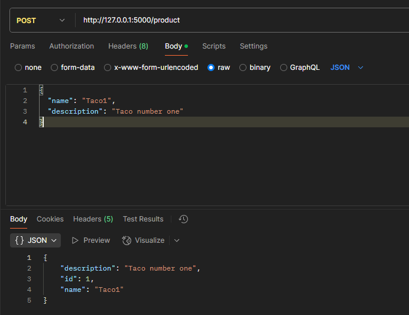
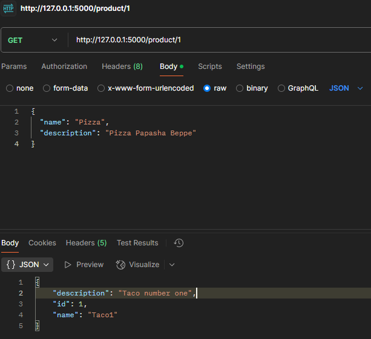
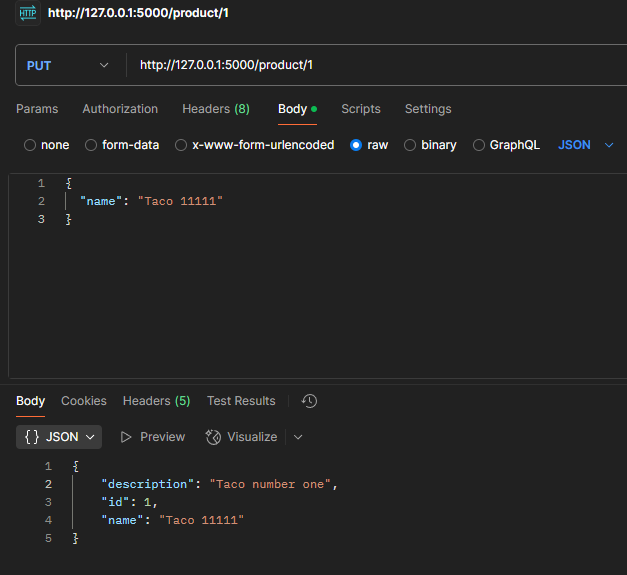
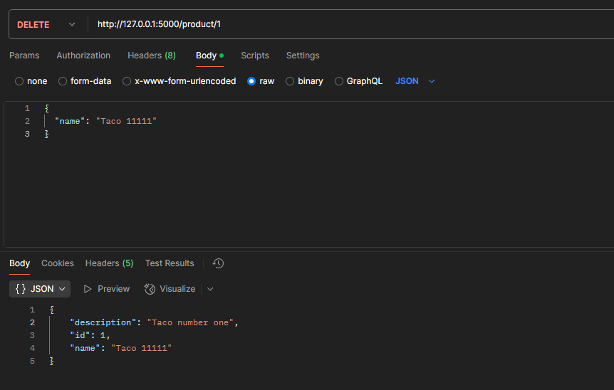
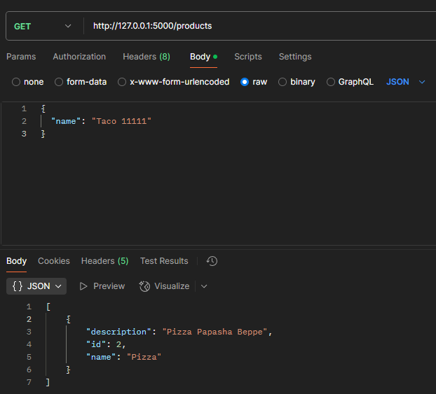
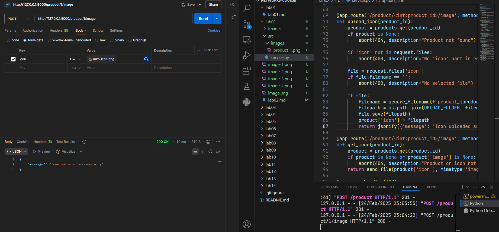
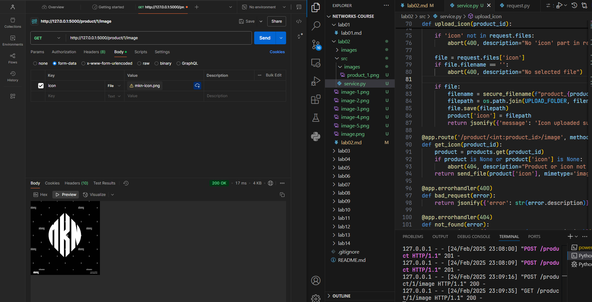

# Практика 2. Rest Service

## Программирование. Rest Service. Часть I

### Задание А (3 балла)
Создайте простой REST сервис, в котором используются HTTP операции GET, POST, PUT и DELETE.
Предположим, что это сервис для будущего интернет-магазина, который пока что умеет 
работать только со списком продуктов. У каждого продукта есть поля: `id` (уникальный идентификатор),
`name` и `description`. 

Таким образом, json-схема продукта (обозначим её `<product-json>`):

```json
{
  "id": 0,
  "name": "string",
  "description": "string"
}
```

Данные продукта от клиента к серверу должны слаться в теле запроса в виде json-а, **не** в параметрах запроса.

Ваш сервис должен поддерживать следующие операции:
1. Добавить новый продукт. При этом его `id` должен сгенерироваться автоматически
   - `POST /product`
   - Схема запроса:
     ```json
     {
       "name": "string",
       "description": "string"
     }
     ```
   - Схема ответа: `<product-json>` (созданный продукт)
2. Получить продукт по его id
   - `GET /product/{product_id}`
   - Схема ответа: `<product-json>`
3. Обновить существующий продукт (обновляются только те поля продукта, которые были переданы в теле запроса)
   - `PUT /product/{product_id}`
   - Схема запроса: `<product-json>` (некоторые поля могут быть опущены)
   - Схема ответа: `<product-json>` (обновлённый продукт)
4. Удалить продукт по его id
   - `DELETE /product/{product_id}`
   - Схема ответа: `<product-json>` (удалённый продукт)
5. Получить список всех продуктов 
   - `GET /products`  
   - Схема ответа:
     ```
     [ 
       <product-json-1>,
       <product-json-2>, 
       ... 
     ]
     ```

Предусмотрите возвращение ошибок (например, если запрашиваемого продукта не существует).

Вы можете положить код сервиса в отдельную директорию рядом с этим документом.

### Задание Б (3 балла)
Продемонстрируйте работоспособность сервиса с помощью программы Postman
(https://www.postman.com/downloads) и приложите соответствующие скрины, на которых указаны
запросы и ответы со стороны сервиса для **всех** его операций.

#### Демонстрация работы
#### POST /product

#### GET /product/{product_id}

#### PUT /product/{product_id}

#### DELETE /product/{product_id}

#### GET /products


### Задание В (4 балла)
Пусть ваш продукт также имеет иконку (небольшую картинку). Формат иконки (картинки) может
быть любым на ваш выбор. Для простоты будем считать, что у каждого продукта картинка одна.

Добавьте две новые операции:
1. Загрузить иконку:
   - `POST product/{product_id}/image`
   - Запрос содержит бинарный файл — изображение  
     
2. Получить иконку:
   - `GET product/{product_id}/image`
   - В ответе передаётся только сама иконка  
     

Измените операции в Задании А так, чтобы теперь схема продукта содержала сведения о загруженной иконке, например, имя файла или путь:
```json
"icon": "string"
```

#### Демонстрация работы
#### POST product/{product_id}/image

#### GET product/{product_id}/image

---

_(*) В последующих домашних заданиях вам будет предложено расширить функционал данного сервиса._

## Задачи

### Задача 1 (2 балла)
Общая (сквозная) задержка прохождения для одного пакета от источника к приемнику по пути,
состоящему из $N$ соединений, имеющих каждый скорость $R$ (то есть между источником и
приемником $N - 1$ маршрутизатор), равна $d_{\text{сквозная}} = N \dfrac{L}{R}$
Обобщите данную формулу для случая пересылки количества пакетов, равного $P$.

#### Решение
1. **Задержка для первого пакета:**
   Первый пакет проходит через $N$ соединений, и его сквозная задержка:
   $
   t_1 = N \dfrac{L}{R}.
   $

2. **Последовательная передачи \(P\) пакетов:**
   Каждый следующий пакет начинает передаваться через первое соединение только после того, как предыдущий пакет его пройдет. Время передачи одного пакета через одно соединение равно $\dfrac{L}{R}$. Поскольку сеть работает как конвейер, после прохождения первого пакета через первое соединение второй пакет начинает движение, и так далее. Для $P$ пакетов добавляется время, связанное с последовательной отправкой $P - 1$ пакетов через первое соединение:
   $
   (P - 1) \dfrac{L}{R}.
   $

3. **Общая сквозная задержка для $P$ пакетов:**
   Общая задержка — это время, за которое последний ($P$-й) пакет достигнет приемника. Она складывается из времени прохождения первого пакета через все $N$ соединений и времени ожидания передачи оставшихся $P - 1$ пакетов:
   $
   d_{\text{сквозная для } P \text{ пакетов}} = N \dfrac{L}{R} + (P - 1) \dfrac{L}{R} = (N + P - 1) \dfrac{L}{R}.
   $
### Задача 2 (2 балла)
Допустим, мы хотим коммутацией пакетов отправить файл с хоста A на хост Б. Между хостами установлены три
последовательных канала соединения со следующими скоростями передачи данных:
$R_1 = 200$ Кбит/с, $R_2 = 3$ Мбит/с и $R_3 = 2$ Мбит/с.
Сколько времени приблизительно займет передача на хост Б файла размером $5$ мегабайт?
Как это время зависит от размера пакета?

#### Решение
При коммутации пакетов через $N$ последовательных соединений общая сквозная задержка для $P$ пакетов определяется как:
$$
d_{\text{сквозная}} = (N + P - 1) \frac{L}{R_{\text{мин}}},
$$
где $R_{\text{мин}}$ — минимальная скорость среди всех каналов, так как она становится "узким местом" в конвейере.


Минимальная скорость: $R_{\text{мин}} = R_1 = 0.2$ Мбит/с.

Размер файла $F = 40$ Мбит, размер пакета $L$ (в Мбитах пока неизвестен). Количество пакетов:
$$
P = \frac{F}{L}.
$$

Общая задержка:
$$
d_{\text{сквозная}} = (N + P - 1) \frac{L}{R_{\text{мин}}}.
$$
Подставим $P = \frac{F}{L}$ и $N = 3$:
$$
d_{\text{сквозная}} = \left(3 + \frac{F}{L} - 1\right) \frac{L}{R_{\text{мин}}} = \left(2 + \frac{F}{L}\right) \frac{L}{R_{\text{мин}}} = 2 \frac{L}{R_{\text{мин}}} + \frac{F}{R_{\text{мин}}}.
$$

- $2 \frac{L}{R_{\text{мин}}}$ — это дополнительная задержка из-за конвейерной передачи первых двух пакетов через три соединения.
- $\frac{F}{R_{\text{мин}}}$ — это время передачи всего объема данных через самый медленный канал.

Если $L$ очень маленький (например, размер пакета составляет несколько байт), то $2 \frac{L}{R_{\text{мин}}}$ становится пренебрежимо малым по сравнению с $\frac{F}{R_{\text{мин}}}$, и:
  $$
  d_{\text{сквозная}} \approx \frac{F}{R_{\text{мин}}}.
  $$

$F = 40$ Мбит, $R_{\text{мин}} = 0.2$ Мбит/с:
$$
d_{\text{сквозная}} \approx \frac{40}{0.2} = 200 \, \text{с}.
$$

- При малых $L$ время передачи определяется в основном $\frac{F}{R_{\text{мин}}}$, и $d_{\text{сквозная}} \approx 200$ с.
- При увеличении $L$ дополнительная задержка $2 \frac{L}{R_{\text{мин}}}$ растет, но $P$ уменьшается, и при $P = 1$ формула упрощается до $N \frac{F}{R_{\text{мин}}}$.
- Влияние $L$ мало при $L \ll F$.


#### Ответ
1. Приблизительное время передачи файла: **200 секунд** (при малом размере пакета).
2. Время увеличивается с ростом размера пакета $L$ как 
   $d_{\text{сквозная}} = \frac{F}{R_{\text{мин}}} + 2 \frac{L}{R_{\text{мин}}}$, но при $L \ll F$ вклад второго слагаемого мал.
### Задача 3 (2 балла)
Предположим, что пользователи делят канал с пропускной способностью $2$ Мбит/с. Каждому
пользователю для передачи данных необходима скорость $100$ Кбит/с, но передает он данные
только в течение $20$ процентов времени использования канала. Предположим, что в сети всего $60$
пользователей. А также предполагается, что используется сеть с коммутацией пакетов. Найдите
вероятность одновременной передачи данных $12$ или более пользователями.

#### Решение
Каждый пользователь независимо активен с вероятностью $p = 0.2$. Это биномиальное распределение, где:
- $n = 60$ — общее число испытаний (пользователей),
- $p = 0.2$ — вероятность "успеха" (пользователь передает данные),
- $k$ — число активных пользователей.

Вероятность того, что ровно $k$ пользователей активны:
$$
P(k) = \binom{n}{k} p^k (1 - p)^{n - k}.
$$
Нам нужно найти $P(k \geq 12)$ — вероятность того, что активны 12 или более пользователей:
$$
P(k \geq 12) = \sum_{k=12}^{60} \binom{60}{k} (0.2)^k (0.8)^{60 - k} = 0.551383
$$

#### Ответ
$0.551383$

### Задача 4 (2 балла)
Пусть файл размером $X$ бит отправляется с хоста А на хост Б, между которыми три линии связи и
два коммутатора. Хост А разбивает файл на сегменты по $S$ бит каждый и добавляет к ним
заголовки размером $80$ бит, формируя тем самым пакеты длиной $L = 80 + S$ бит. Скорость
передачи данных по каждой линии составляет $R$ бит/с. Загрузка линий мала, и очередей пакетов
нет. При каком значении $S$ задержка передачи файла между хостами А и Б будет минимальной?
Задержкой распространения сигнала пренебречь.

#### Решение
$$
d_{\text{сквозная}} = (N + P - 1) \frac{L}{R}.
$$
- $N = 3$ — число линий,
- $P = \frac{X}{S}$ — число пакетов,
- $L = S + 80$ — длина одного пакета.

Подставим значения:
$$
d_{\text{сквозная}} = \left(3 + \frac{X}{S} - 1\right) \frac{S + 80}{R} = \left(2 + \frac{X}{S}\right) \frac{S + 80}{R} = \frac{(2 + \frac{X}{S})(S + 80)}{R} = \frac{2(S + 80) + \frac{X}{S}(S + 80)}{R} = \frac{2S + 160 + X + \frac{80X}{S}}{R}.
$$

Возьмем производную $d$ по $S$ и приравняем к нулю. Учитываем, что $R$ — константа, и производная делится на $R$, так что можем работать с числителем:

$$
d(S) = 2S + X + 160 + \frac{80X}{S}.
$$

$$
d'(S) = 2 - \frac{80X}{S^2} = 0.
$$

$$
2 - \frac{80X}{S^2} = 0 \implies \frac{80X}{S^2} = 2 \implies S^2 = \frac{80X}{2} = 40X \implies S = \sqrt{40X}.
$$

Проверим, что это минимум.

Вторая производная:
$$
d''(S) = \frac{d}{dS} \left(2 - \frac{80X}{S^2}\right) = \frac{160X}{S^3}.
$$
При $S > 0$ (а размер сегмента всегда положителен), $d''(S) > 0$, значит, это минимум.

#### Ответ
Задержка передачи файла минимальна при:
$$
S = \sqrt{40X}.
$$

### Задание 5 (2 балла)
Рассмотрим задержку ожидания в буфере маршрутизатора. Обозначим через $I$ интенсивность
трафика, то есть $I = \dfrac{L a}{R}$.
Предположим, что для $I < 1$ задержка ожидания вычисляется как $\dfrac{I \cdot L}{R (1 – I)}$. 
1. Напишите формулу для общей задержки, то есть суммы задержек ожидания и передачи.
2. Опишите зависимость величины общей задержки от значения $\dfrac{L}{R}$.

#### Решение
$d_{\text{общая}} = d_{\text{ожидания}} + d_{\text{передачи}}$, где:
- $d_{\text{ожидания}}$ — время, которое пакет проводит в очереди, ожидая обработки.
- $d_{\text{передачи}}$ — время, необходимое для передачи пакета через линию после начала обработки.

$d_{\text{ожидания}} = \frac{I \cdot L}{R (1 - I)}$ (по условию)

$d_{\text{передачи}} = \frac{L}{R}$

$$
d_{\text{общая}} = d_{\text{ожидания}} + d_{\text{передачи}} = \frac{I \cdot L}{R (1 - I)} + \frac{L}{R} = \frac{I \cdot L + L (1 - I)}{R (1 - I)} = \frac{L (I + 1 - I)}{R (1 - I)} = \frac{L}{R (1 - I)}
$$

Подставим $I = \frac{L a}{R}$:
$$
d_{\text{общая}} = \frac{L}{R \left(1 - \frac{L a}{R}\right)} = \frac{L}{R - L a}.
$$

#### Оценим зависимость от $\frac{L}{R}$

Пусть $\frac{L}{R} = t$

Тогда $L = t R$, и подставим в формулу:
  $$
  d_{\text{общая}} = \frac{t R}{R - t R a} = \frac{t R}{R (1 - t a)} = \frac{t}{1 - t a}.
  $$

- **Условие $I < 1$**: $I = \frac{L a}{R} = t a < 1 \implies t < \frac{1}{a}$. Это гарантирует, что знаменатель $1 - t a > 0$, и задержка конечна.
- **При $t \to 0$** (маленький $L$ или большой $R$): $d_{\text{общая}} \approx t$ — задержка мала и пропорциональна $\frac{L}{R}$.
- **При $t \to \frac{1}{a}$** (рост $L$ или уменьшение $R$): знаменатель $1 - t a \to 0^+$, и $d_{\text{общая}} \to +\infty$ — задержка резко возрастает.
- **Монотонность**: первая производная по $t$:
  $$
  d_{\text{общая}}(t) = \frac{t}{1 - t a}, \quad d'_{\text{общая}}(t) = \frac{(1 - t a) \cdot 1 - t \cdot (-a)}{(1 - t a)^2} = \frac{1 - t a + t a}{(1 - t a)^2} = \frac{1}{(1 - t a)^2}.
  $$
  При $t < \frac{1}{a}$ производная $> 0$, функция возрастает.

#### Ответ
1. Формула общей задержки:
   $$
   d_{\text{общая}} = \frac{L}{R - L a}.
   $$
2. Зависимость от $\frac{L}{R}$: задержка возрастает с ростом $\frac{L}{R}$, оставаясь конечной при $\frac{L}{R} < \frac{1}{a}$, и стремится к бесконечности при $\frac{L}{R} \to \frac{1}{a}$.