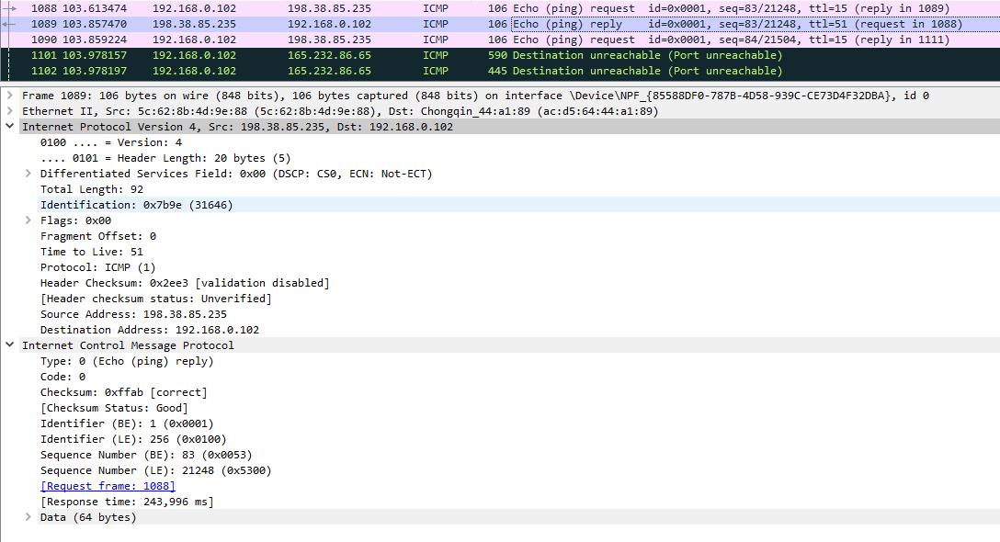

# Практика 9. Сетевой уровень

## Wireshark: ICMP
В лабораторной работе предлагается исследовать ряд аспектов протокола ICMP:
- ICMP-сообщения, генерируемые программой Ping
- ICMP-сообщения, генерируемые программой Traceroute
- Формат и содержимое ICMP-сообщения

### 1. Ping (4 балла)
Программа Ping на исходном хосте посылает пакет на целевой IP-адрес; если хост с этим адресом
активен, то программа Ping на нем откликается, отсылая ответный пакет хосту, инициировавшему
связь. Оба этих пакета Ping передаются по протоколу ICMP.

Выберите какой-либо хост, расположенный на другом континенте (например, в Америке или
Азии). Захватите с помощью Wireshark ICMP пакеты от утилиты ping.
Для этого из командной строки запустите команду (аргумент `-n 10` означает, что должно быть
отослано 10 ping-сообщений): `ping –n 10 host_name`

Для анализа пакетов в Wireshark введите строку icmp в области фильтрации вывода.

#### Вопросы
1. Каков IP-адрес вашего хоста? Каков IP-адрес хоста назначения?
   - 192.168.0.102
   - 198.38.85.235
2. Почему ICMP-пакет не обладает номерами исходного и конечного портов?
   - ICMP-пакеты не содержат номеров исходного и конечного портов, потому что они работают на сетевом уровне. Номера портов характерны для протоколов транспортного уровня (Layer 4), таких как TCP и UDP, которые используют их для идентификации конкретных приложений или служб на хостах. ICMP предназначен для управляющих и диагностических сообщений (например, для Ping или Traceroute), а не для передачи данных приложений, поэтому номера портов ему не нужны.
3. Рассмотрите один из ping-запросов, отправленных вашим хостом. Каковы ICMP-тип и кодовый
   номер этого пакета? Какие еще поля есть в этом ICMP-пакете? Сколько байт приходится на поля 
   контрольной суммы, порядкового номера и идентификатора?
   
   - Тип 8 (Echo Request). Кодовый номер: 0
   - Checksum (Контрольная сумма), Identifier (Идентификатор), Sequence Number (Порядковый номер), Optional Data (Необязательные данные) 
   - Каждый по 2 байта
4. Рассмотрите соответствующий ping-пакет, полученный в ответ на предыдущий. 
   Каковы ICMP-тип и кодовый номер этого пакета? Какие еще поля есть в этом ICMP-пакете? 
   Сколько байт приходится на поля контрольной суммы, порядкового номера и идентификатора?
   
   - Тип 0 (Echo reply). Кодовый номер: 0
   - Checksum (Контрольная сумма), Identifier (Идентификатор), Sequence Number (Порядковый номер), Optional Data (Необязательные данные)  
   - Каждый по 2 байта

### 2. Traceroute (4 балла)
Программа Traceroute может применяться для определения пути, по которому пакет попал с
исходного на конечный хост.

Traceroute отсылает первый пакет со значением TTL = 1, второй – с TTL = 2 и т.д. Каждый
маршрутизатор понижает TTL-значение пакета, когда пакет проходит через этот маршрутизатор.
Когда на маршрутизатор приходит пакет со значением TTL = 1, этот маршрутизатор отправляет
обратно к источнику ICMP-пакет, свидетельствующий об ошибке.

Задача – захватить ICMP пакеты, инициированные программой traceroute, в сниффере Wireshark.
В ОС Windows вы можете запустить: `tracert host_name`

Выберите хост, который **расположен на другом континенте**.

#### Вопросы
1. Рассмотрите ICMP-пакет с эхо-запросом на вашем скриншоте. Отличается ли он от ICMP-пакетов
   с ping-запросами из Задания 1 (Ping)? Если да – то как?
   - Не отличается
2. Рассмотрите на вашем скриншоте ICMP-пакет с сообщением об ошибке. В нем больше полей,
   чем в ICMP-пакете с эхо-запросом. Какая информация содержится в этих дополнительных полях?
   - "Time Exceeded" (тип 11, код 0) содержит IP-заголовок исходного пакета и первые 8 байт его данных для идентификации пакета.
3. Рассмотрите три последних ICMP-пакета, полученных исходным хостом. Чем эти пакеты
   отличаются от ICMP-пакетов, сообщающих об ошибках? Чем объясняются такие отличия?
   - Они отличаются типом (0 вместо 11)
   - Объясняются тем, что датаграмма дошла до целевого хоста, не превысив TTL
4. Есть ли такой канал, задержка в котором существенно превышает среднее значение? Можете
   ли вы, опираясь на имена маршрутизаторов, определить местоположение двух маршрутизаторов,
   расположенных на обоих концах этого канала?
   - Наиболее значительный скачок задержки происходит между 9-м и 10-м хопами:
   Хоп 9: 36 мс, 38 мс, 34 мс (среднее ~36 мс);
   Хоп 10: 254 мс, 247 мс, 243 мс (среднее ~248 мс).
   - Хоп 9: 80.249.212.246
Имя маршрутизатора не указано, но предыдущий хоп (8-й) — ae18-2.rt.tc2.ams.nl.retn.net [87.245.232.122] — явно указывает на Амстердам, Нидерланды (код "ams.nl" соответствует Amsterdam, Netherlands). Задержка между хопом 8 (31–33 мс) и хопом 9 (34–38 мс) минимальна, что говорит о том, что они находятся в одной географической зоне. Таким образом, маршрутизатор с IP 80.249.212.246, скорее всего, также расположен в Амстердаме, Нидерланды.

Хоп 10: 103.198.140.55
Имя маршрутизатора также не указано, но значительный скачок задержки (до 243–254 мс) указывает на переход через большое расстояние, вероятно, межконтинентальный. Конечный пункт трассировки — 725845-spsu.ac.in [198.38.85.235] — имеет домен .ac.in, что соответствует Индии (академическое учреждение в Индии). Последующие хопы, такие как 11-й (49.45.4.252) и 13-й (115.244.215.242), имеют IP-адреса, часто ассоциируемые с Индией. Следовательно, маршрутизатор с IP 103.198.140.55, вероятно, находится в Индии.

## Программирование.

### 1. IP-адрес и маска сети (1 балл)
Напишите консольное приложение, которое выведет IP-адрес вашего компьютера и маску сети на консоль.

#### Демонстрация работы

### 2. Доступные порты (2 балла)
Выведите все доступные (свободные) порты в указанном диапазоне для заданного IP-адреса. 
IP-адрес и диапазон портов должны передаваться в виде входных параметров.

#### Демонстрация работы

### 3. Широковещательная рассылка для подсчета копий приложения (6 баллов)
Разработать приложение, подсчитывающее количество копий себя, запущенных в локальной сети.
Приложение должно использовать набор сообщений, чтобы информировать другие приложения
о своем состоянии. После запуска приложение должно рассылать широковещательное сообщение
о том, что оно было запущено. Получив сообщение о запуске другого приложения, оно должно
сообщать этому приложению о том, что оно работает. Перед завершением работы приложение
должно информировать все известные приложения о том, что оно завершает работу. На экран
должен выводиться список IP адресов компьютеров (с указанием портов), на которых приложение
запущено.

Приложение считает другое приложение запущенным, если в течение промежутка времени,
равного нескольким интервалам между рассылками широковещательных сообщений, от него
пришло сообщение.

**Такое приложение может быть использовано, например, при наличии ограничения на
количество лицензионных копий программ.*

Пример GUI:

#### Демонстрация работы

## Задачи. Работа протокола TCP

### Задача 1. Докажите формулы (3 балла)
Пусть за период времени, в который изменяется скорость соединения с $\frac{W}{2 \cdot RTT}$
до $\frac{W}{RTT}$, только один пакет был потерян (очень близко к концу периода).
1. Докажите, что частота потери $L$ (доля потерянных пакетов) равна
   $$L = \dfrac{1}{\frac{3}{8} W^2 + \frac{3}{4} W}$$
2. Используйте выше полученный результат, чтобы доказать, что, если частота потерь равна
   $L$, то средняя скорость приблизительно равна
   $$\approx \dfrac{1.22 \cdot MSS}{RTT \cdot \sqrt{L}}$$

#### Решение
#### Доказательство формулы для $L$

В фазе избежания перегрузки (congestion avoidance) размер окна увеличивается на 1 MSS за каждый RTT.

При потере пакета размер окна уменьшается до $\frac{W}{2}$, затем снова растет до $W$.

Период начинается с окна $\frac{W}{2}$ и заканчивается при $W$, с одной потерей в конце.

#### Число RTT в периоде:
Размер окна увеличивается от $\frac{W}{2}$ до $W$.
Число RTT: $W - \frac{W}{2} = \frac{W}{2}$.

#### Общее число отправленных пакетов:
Размер окна в каждом RTT: $\frac{W}{2}, \frac{W}{2} + 1, \ldots, W$.
Число RTT: $\frac{W}{2} + 1$ (включая конечное окно $W$).
Сумма пакетов $N$: $N = \sum_{i=\frac{W}{2}}^{W} i$ Используем формулу суммы арифметической прогрессии: $N = \frac{\left( \frac{W}{2} + 1 \right) \left( \frac{W}{2} + W \right)}{2} = \frac{\left( \frac{W}{2} + 1 \right) \cdot \frac{3W}{2}}{2} = \frac{3W \left( \frac{W}{2} + 1 \right)}{4}$ 

$N = \frac{3W (W + 2)}{8} = \frac{3W^2 + 6W}{8} = \frac{3}{8} W^2 + \frac{3}{4} W$

#### Частота потерь:

Потерян 1 пакет из $N$.

Частота потерь: $L = \frac{1}{N} = \frac{1}{\frac{3}{8} W^2 + \frac{3}{4} W}$

#### Доказательство формулы для средней скорости

#### Средняя скорость:
Средняя скорость $T$: $T = \frac{W_{\text{avg}} \cdot MSS}{RTT}$

Средний размер окна: $W_{\text{avg}} = \frac{\frac{W}{2} + W}{2} = \frac{3W}{4}$

Тогда: $T = \frac{3W \cdot MSS}{4 \cdot RTT}$

Связь $W$ и $L$:

Из части 1: $L = \frac{1}{\frac{3}{8} W^2 + \frac{3}{4} W}$

Для больших $W$, 

$\frac{3}{8} W^2 \gg \frac{3}{4} W$: 

$L \approx \frac{1}{\frac{3}{8} W^2} = \frac{8}{3 W^2}$ 

$W^2 \approx \frac{8}{3 L}$ 

$W \approx \sqrt{\frac{8}{3 L}} = \sqrt{\frac{8}{3}} \cdot \frac{1}{\sqrt{L}}$

Подставим $W$: $T \approx \frac{3 \cdot \sqrt{\frac{8}{3}} \cdot MSS}{4 \cdot RTT \cdot \sqrt{L}}$

Вычислим константу: $\sqrt{\frac{8}{3}} \approx 1.633, \quad \frac{3}{4} \cdot \sqrt{\frac{8}{3}} \approx \frac{3}{4} \cdot 1.633 \approx 1.22475$

Упростим: $\frac{3}{4} \cdot \sqrt{\frac{8}{3}} = \frac{3}{4} \cdot \frac{\sqrt{8}}{\sqrt{3}} = \frac{3 \sqrt{8}}{4 \sqrt{3}} = \sqrt{\frac{9 \cdot 8}{16 \cdot 3}} = \sqrt{\frac{72}{48}} = \sqrt{1.5} \approx 1.2247$

Тогда: $T \approx \frac{1.22 \cdot MSS}{RTT \cdot \sqrt{L}}$

### Задача 2. Найдите функциональную зависимость (3 балла)
Рассмотрим модификацию алгоритма управления перегрузкой протокола TCP. Вместо
аддитивного увеличения, мы можем использовать мультипликативное увеличение. 
TCP-отправитель увеличивает размер своего окна в небольшую положительную 
константу $a$ ($a > 1$), как только получает верный ACK-пакет.
1. Найдите функциональную зависимость между частотой потерь $L$ и максимальным
размером окна перегрузки $W$.
2. Докажите, что для этого измененного протокола TCP, независимо от средней пропускной
способности, TCP-соединение всегда требуется одинаковое количество времени для
увеличения размера окна перегрузки с $\frac{W}{2}$ до $W$.

#### Решение
### Часть 1: Зависимость частоты потерь $L$ от максимального размера окна $W$
### Поведение окна
- После потери пакета окно сбрасывается до $W/2$.
- За каждый RTT размер окна умножается на $a$:
  - Начальный размер: $w_0 = W/2$,
  - После 1 RTT: $w_1 = a \cdot W/2$,
  - После 2 RTT: $w_2 = a^2 \cdot W/2$,
  - И так далее, пока окно не достигнет $W$, после чего происходит потеря пакета.

### Сколько RTT нужно до потери?
- Окно достигает $W$ при $w_k = a^k \cdot W/2 = W$.
  $$
  a^k \cdot W/2 = W \implies a^k = 2 \implies k = \log_a 2
  $$
- Таким образом, потеря происходит через $k = \log_a 2$ RTT. Предположим, что потеря случается точно при $w_k = W$.

### Общее количество пакетов за цикл
- За каждый RTT отправляется $w_i$ пакетов.
- Суммарное количество пакетов $N$ от $W/2$ до $W$:
  $$
  N = w_0 + w_1 + \cdots + w_k = W/2 + a \cdot W/2 + a^2 \cdot W/2 + \cdots + a^k \cdot W/2
  $$
  $$
  N = W/2 \sum_{i=0}^{k} a^i
  $$
- Сумма геометрической прогрессии:
  $$
  \sum_{i=0}^{k} a^i = (a^{k+1} - 1)/(a - 1)
  $$
- Так как $a^k = 2$, то $a^{k+1} = a \cdot a^k = 2a$, и:
  $$
  N = W/2 \cdot (2a - 1)/(a - 1)
  $$

### Частота потерь
- В цикле отправляется $N$ пакетов, из них один теряется.
- Частота потерь:
  $$
  L = 1/N = 2 (a - 1)/(W (2a - 1))
  $$
- Заметим, что $L$ обратно пропорциональна $W$.

### Итог для части 1
Функциональная зависимость:
$$
L = 2 (a - 1)/(W (2a - 1))
$$

### Часть 2: Постоянство времени увеличения окна

### Анализ процесса увеличения
- Окно растет мультипликативно: $w_{i+1} = a \cdot w_i$, начиная с $w_0 = W/2$.
- Нужно определить количество RTT, чтобы $w_k \geq W$:
  $$
  a^k \cdot W/2 = W \implies a^k = 2 \implies k = \log_a 2
  $$
- Время увеличения составляет $k = \log_a 2$ RTT.

### Независимость от пропускной способности
- Пропускная способность зависит от $W$ и $L$, которые могут меняться в зависимости от сети.
- Однако $k = \log_a 2$ определяется только коэффициентом $a$ и не зависит от $W$ или пропускной способности.
- Таким образом, время увеличения окна всегда фиксировано и равно $\log_a 2$ RTT.

### Итог для части 2
Время увеличения окна с $W/2$ до $W$ всегда одинаково и составляет $\log_a 2$ RTT, независимо от средней пропускной способности.

### Ответ
1. Функциональная зависимость:
   $$
   L = 2 (a - 1)/(W (2a - 1))
   $$
2. Время увеличения окна:
   $$
   k = \log_a 2 \text{ RTT}
   $$